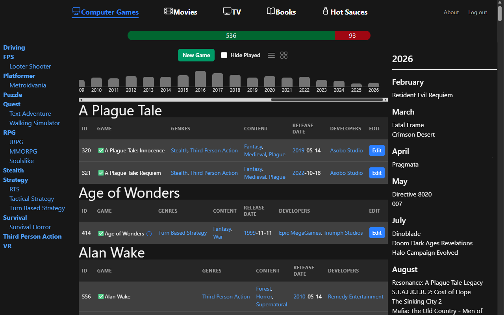

# Summary

Quokka is a tool for keeping track of organized lists of things. Great for computer games, TV shows,
movies, books, and anything else you can organize into sublists.

You should probably install Tailwind Fold to view this properly.

